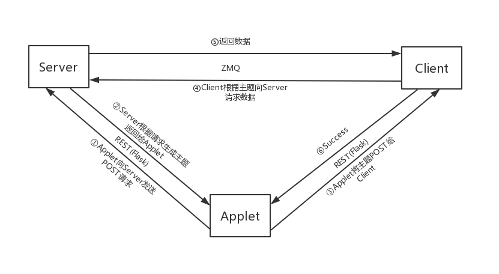

# rest - zmq - demo
学习rest和zmq结合做的demo

## TODOs

- [x] 解决test6里全局变量的问题 (4.5)
- [x] 把函数和变量封装成类 (4.8)
- [x] 把client的数据也做成json文件 (4.9)
- [x] 代码重构 增加复用性 (4.10)
- [ ] 和需求不太一致 重新做(4.11)

## 目录

├── test1 zmq(sub and pub) 	                //  zmq SUB-PUB 实例

│        ├── testclient.py                           // client通过订阅接收server发送的数据

│        └── testserver.py

├── test2 zmq and rest                         // 通过创建线程实现flask和zmq共存

│        ├── client.py                             // client通过rest接口获取主题，通过主题接收数据

│        └── server.py

├── test3 2 zip_filter                             // 在test2的基础上做了两个主题的尝试

│        ├── client.py

│        └── server.py

├── test4 3 zip_filter with json                   // 三个主题的 主题-数据 转换成json格式方便存取使用

│        ├── client.py

│        └── server.py

├── test5 zmq(req and rep)                    // 用REQ-REP的方式实现了上述功能

│        ├── client.py

│        └── server.py

├── test6 applet server client                    // 经过讨论后发现自己之前的理解有偏差 加了一个小程序

│        ├── applet.py                             // applet负责向server发送请求获取主题,将主题告知client

│        ├── client.py                               // client通过rest获取主题, 然后通过zmq接口获取数据

│        └── server.py                             // server获取到applet的点后(rest)生成主题(未实现)，返回给

│                                              // applet，然后通过zmq接口广播数据(见结构图)

├── test7 server client applet                   // 用文件输入输出解决了 作用域/线程 的不能修改变量的bug

│        ├── applet.py

│        ├── client.py

│        ├── data.json

│        └── server.py

├── test8 Abstraction and Encapsulation          // 对topic进行了封装

│        ├── applet.py

│        ├── client.py

│        ├── data.json

│        └── server.py

├── test9 Some improvements                // 将两个topic存在了文件里，对代码进行了微调

│        ├── data

│                 ├── client_topic.json

│                 └── server_topic.json

│        ├── applet.py

│        ├── client.py

│        ├── server.py

│                └── topic.py

├── test10 threading                // 写了个线程类 每请求一次会创建一个线程(和需求不符)

│        ├── applet.py

│        ├── client.py

│        ├── server.py

│        ├── topic_threading.py

│        ├── Python 面向对象编程.md

│        ├── Python3入门之线程threading常用方法.md

│        └── Python3入门之线程实例常用方法及属性设置

├── 笔记                                    // 学习笔记 后面分享用得到

│        ├── img

│                  └── pic.png

│        └── 笔记.md

├── README.md

├── test.json

└── test.py                            	// 测试用的文件

## 说明

### 结构图:

