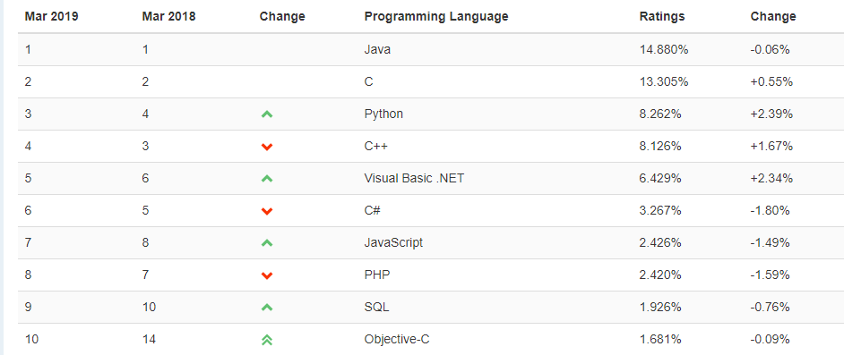
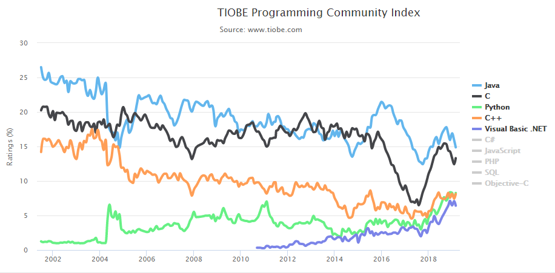
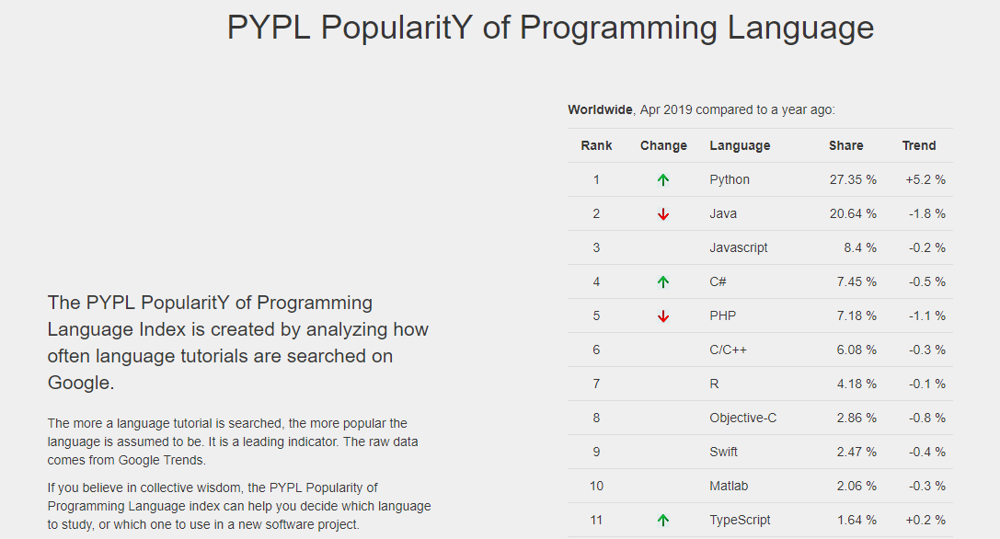
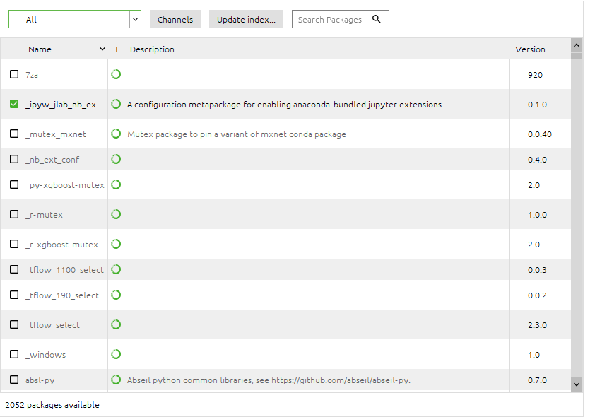
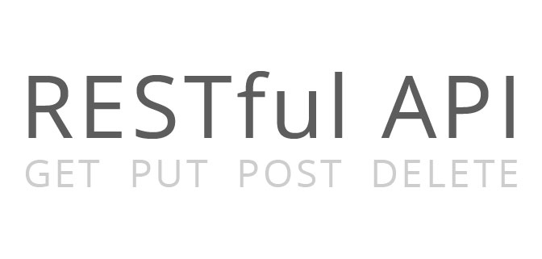
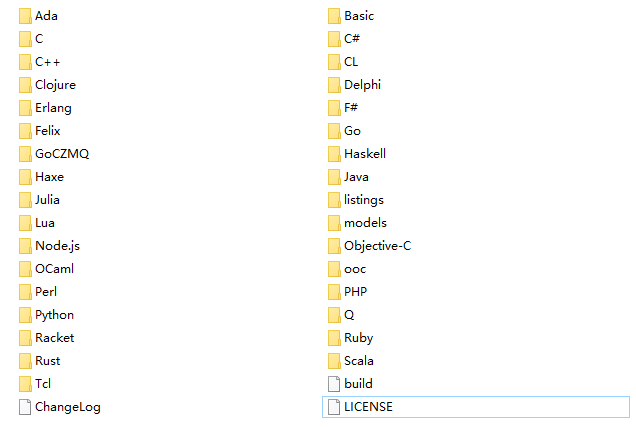
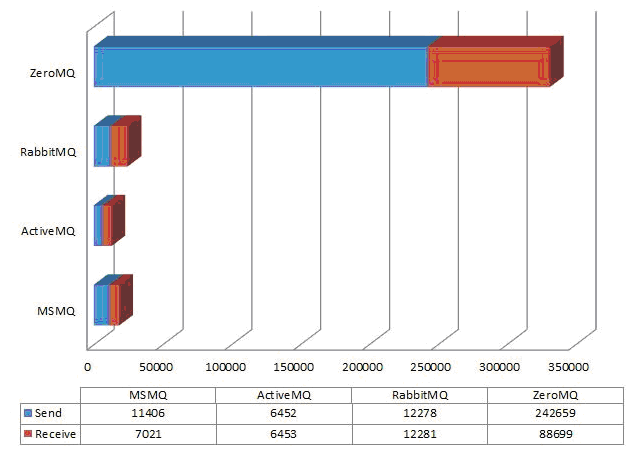
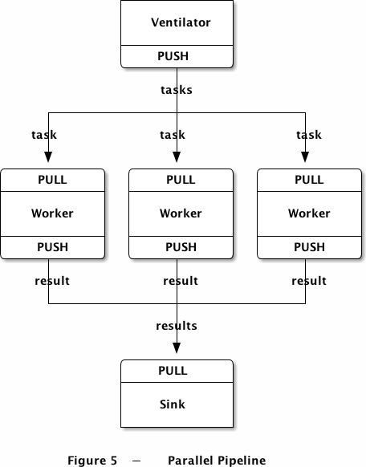

[TOC]


# 笔记

## 一、python语言

Python, 是一门面向对象的解释型计算机程序设计语言，由荷兰人Guido van Rossum于1989年发明，第一个公开发行版发行于1991年。Python语法简洁清晰，特色之一是强制用空白符（white space）作为语句缩进。 Python具有丰富和强大的库。它常被昵称为胶水语言，能够把用其他语言制作的各种模块（尤其是C/C++）很轻松地联结在一起。常见的一种应用情形是，使用Python快速生成程序的原型（有时甚至是程序的最终界面），然后对其中有特别要求的部分，用更合适的语言改写。

### 1. python的定位

#### 1) 目前形式



在2019年三月的 TIOBE 编程语言排行榜中，Python超过C++成为编程语言的第三位，根据走势图，Python语言还呈现着欣欣向荣的形式，可以预测在不远的未来Python可以坐稳第三位的宝座：



而在另一家编程语言排行网站PYPL里，Python已经占据榜首。



#### 2) 为什么这么火

在Python开发领域流传着这样一句话：人生苦短，我用Python。（“Life is short, you need Python!”——Bruce Ecke）虽说是戏言，但也恰恰可以从另一个角度反映出Python的优势。

- 优雅，明确，简单

  这是Python语言的设计哲学，尽量写容易看明白的代码，尽量写少的代码。

  ```python
  return lambda x: lambda y: x + y
  
  new_list = [v[1] for v in old_list if v[2]]
  ```

  简明优雅带来的好处就是，代码量下降明显，易于开发和维护。代码量的下降意味着开发周期的缩短，这在一定程度上减轻了程序员的开发负担。尽管Python是一种解释型语言，与传统的编译型语言相比降低了机器执行效率，但是处理器的处理速率与环境速率（比如网络环境）的差异在大多数场景中完全抵消了上述代价；牺牲部分运行效率带来的好处则是提升了开发效率，在跨平台的时候无需移植和重新编译。 所以Python的显著优点在于速成，对于时间短、变化快的需求而言尤为胜任。

  Python用空白符作为语句缩进，使用缩进来组织代码块，所以写出的代码都是格式化的、规范的，代码可读性极佳。

- 丰富

  Python除了“胶水语言”，还有一个外号叫“内置电池”。“内置电池”的意思是，Python官方本身提供了非常完善的标准代码库，包括针对网络编程、输入输出、文件系统、图形处理、数据库、文本处理等等。程序员只需通过加载、调用等操作手段即可实现对库中函数、功能的利用，从而省去了自己编写大量代码的过程，让编程工作看起来更像是在“搭积木”。除了内置库，开源社区和独立开发者长期为Python贡献了丰富大量的第三方库，其数量远超其他主流编程语言，在程序员编码的过程中，可以方便的使用这些库，从而避免了大量代码的编写过程。

  

- 全能

  系统运维、图形处理、数学处理、文本处理、数据库编程、网络编程、web编程、多媒体应用、pymo引擎、黑客编程、爬虫编写、机器学习、人工智能等等，应用无处不在。

  [Python资源大全中文版](https://github.com/jobbole/awesome-python-cn)

- 可移植性

  绝大多数python程序能不做任何修改即可在所有主流计算机平台上运行

### 2.  我看到的Python的几个简单特性

#### 1) 赋值

    ```python
    >>>a, b = 1, 2
    >>>a
    1
    >>>b
    2
    >>>a, b = b, a
    >>>a
    2
    >>>b
    1
    
    >>> a = [1, 2, 3]
    >>> x, y, z = a 
    >>> x
    1
    >>> y
    2
    >>> z
    3
    ```

#### 2) 切片

  ```python
  >>> L = list(range(100))
  >>> L
  [0, 1, 2, 3, ..., 99]
  
  >>> L[10:20]
  [10, 11, 12, 13, 14, 15, 16, 17, 18, 19]
  
  >>> L[:10:2]
  [0, 2, 4, 6, 8]
  
  >>> L[-10:]
  [90, 91, 92, 93, 94, 95, 96, 97, 98, 99]
  
  >>>L[::-1]
  [99, 98, 97, 96, ..., 0]
  ```

#### 3) 迭代

  遍历list或者tuple的过程叫迭代。

  ```python
  d = {'a': 1, 'b': 2, 'c': 3}
  for key in d:
  	print(key) # a   b   c
     
  for i, value in enumerate(['A', 'B', 'C']):
  	print(i, value) # 0 A   1 B   2 C
      
  for x, y in [(1, 1), (2, 4), (3, 9)]:
  	print(x, y) # 1 1   2 4   3 9
  ```

#### 4) 列表生成式

  不使用列表生成式生成 [1x1, 2x2, 3x3, ..., 10x10]:

  ```python
  L = []
  for x in range(1, 11):
  	L.append(x * x)
  #  L   [1, 4, 9, 16, 25, 36, 49, 64, 81, 100]
  ```

  使用列表生成式:

  ```python
  [x * x for x in range(1, 11)]  
  [1, 4, 9, 16, 25, 36, 49, 64, 81, 100]
  ```

  在列表生成式的 for 循环后还可以加入 if 判断:

  ```python
  [x * x for x in range(1, 11) if x % 2 == 0]
  [4, 16, 36, 64, 100]
  ```

#### 5) map & reduce 函数

  谷歌的Hadoop的MapReduce模型Mapreduce 是一个分布式运算程序的编程框架，用于大规模数据集的并行运算。思想：分治。概念：Map（映射）和Reduce（归约）。

  map函数:

  ```python
  >>> def f(x):
  ...     return x * x
  ...
  >>> r = map(f, [1, 2, 3, 4, 5, 6, 7, 8, 9])
  >>> list(r)
  [1, 4, 9, 16, 25, 36, 49, 64, 81]
  ```

  reduce函数:

  ```python
  >>> from functools import reduce
  >>> def fn(x, y):
  ...     return x * 10 + y
  ...
  >>> reduce(fn, [1, 3, 5, 7, 9])
  13579
  ```

### 3. 一个demo

demo

## 二、RESTful

### 1. 什么是RESTful



REST -- Representational State Transfer，学名是表述性状态转移。

实际上它的全称是： Resource Representational State Transfer，用通俗的话来讲就是：资源在网络中以某种表现形式进行状态转移。


资源是什么？任何事物，只要有被引用到的必要，它就是一个资源。资源可以是实体(例如手机号码)，也可以只是一个抽象概念(例如价值) 。

- 某用户的手机号码
- 某用户的个人信息
- 最多用户订购的GPRS套餐
- 两个产品之间的依赖关系
- 某用户可以办理的优惠套餐
- 某手机号码的潜在价值

要让一个资源可以被识别，需要有个唯一标识，在Web中这个唯一标识就是URI(Uniform Resource Identifier)统一资源标识符。

URL(Uniform Resource Locators)统一资源定位符，是URI最常见的表现形式。URL描述了一台特定服务器上某资源的特定位置。它们可以明确地说明应该使用何种服务，如何从一个精确、固定的位置获取资源。

一般的，每个资源至少有一个URI与之对应，最典型的URI即URL。


Representational - 表述性（表征、表现层）：表现形式，比如JSON，XML，JPEG等。

State Transfer - 状态变化（转移）：通过HTTP动词（方法）实现。用HTTP协议里的动词来实现资源的添加，修改，删除等操作，即状态扭转：

HTTP方法:

- GET
- POST
- PUT
- DELETE

用一句话来概括：**URL定位资源，用HTTP动词（GET,POST,PUT,DELETE）描述操作**。


### 2. 为什么要使用RESTful

举个例子。没有使用REST规范的URL：

获取好友:

```vbscript
GET api/getfriends
```

添加好友:

```vbscript
GET api/addfriends
```

编辑好友:

```vbscript
GET api/editfriends/:friend_id
```

删除好友:

```vbscript
GET api/deletefriends/:friend_id
```

我们上面说到，URI是用来标识资源的，可上面的URI并没有标识出资源，而是向我们展示了对资源的操作。而且只用到了GET操作。但是URI 的设计初衷是负责把资源通过合理方式暴露出来，对资源的操作与它无关，操作是通过 HTTP动词来体现，所以REST 通过 URI 暴露资源时，会强调不要在 URI 中出现动词：

获取好友:

```vbscript
GET api/friends
```

添加好友:

```
POST api/friends
```

编辑好友:

```vbscript
PUT api/friends/:friend_id
```

删除好友:

```vbscript
DELETE api/friends/:friend_id
```

REST 非常强调应该利用好 HTTP本来就有的特征，而不是只把 HTTP当成一个传输层。

#### rest的六个约束

说到rest的优点，就不得不提rest的六个约束：

1. Client–server 客户端-服务器模式 

​	客户端服务器分离可以提高用户界面的便携性（操作简单），通过简化服务器提高可伸缩性（高性能，低成本），允许组件分别优化（可以让服务端和客户端分别进行改进和优化）。

2. Stateless 无状态

​	从客户端的每个请求要包含服务器所需要的所有信息，这样可以提高可见性（可以单独考虑每个请求），提高了可靠性（更容易从局部故障中修复），提高可扩展性（降低了服务器资源使用）。

3. Cacheable 可缓存 

​	服务器返回信息必须被标记是否可以缓存，如果缓存，客户端可能会重用之前的信息发送请求。减少了交互次数，减少交互的平均延迟。

4. Layered system 分层系统

​	系统组件不需要知道与他交流组件之外的事情。封装服务，引入中间层。限制了系统的复杂性，提高可扩展性。

5. Uniform interface 统一接口

​	通信链的组件之间通过统一的接口相互通信，以提高交互的可见性，鼓励单独改善组件。

6. Code on demand (optional) 按需扩展代码（可选） 

​	支持通过下载并执行一些代码（例如Java Applet、Flash或JavaScript），对客户端的功能进行扩展，提高了可扩展性。

### 3. demo

[github.com](https://github.com/Microsoft/calculator)

## 三、ZMQ


### 1. 什么是ZMQ

ZMQ（ØMQ，ZeroMQ，0MQ） ->  Zero Messaging Queue

> 一开始ZMQ代表零中间件、零延迟，同时，它又有了新的含义：零管理、零成本、零浪费。总的来说，零表示最小、最简，这是贯穿于该项目的哲理。我们致力于减少复杂程度，提高易用性。

#### 1) 是什么

- ZMQ是一个基于消息队列的多线程网络库，是一个为可伸缩的分布式或并发应用程序设计的高性能异步消息库。

- ZMQ是网络通信中新的一层，介于应用层和传输层之间（按照TCP/IP划分），其是一个可伸缩层，可并行运行，分散在分布式系统间。

#### 2) 做了什么

- 对套接字类型、连接处理、帧、甚至路由的底层细节进行抽象，提供跨越多种传输协议的套接字。

- 封装了网络通信、消息队列、线程调度等功能，向上层提供简洁的API，应用程序通过加载库文件，调用API函数来实现高性能网络通信。

- 提供了各种传输工具，如进程内，进程间，TCP和组播中进行原子消息传递的套接字。

- 提供一个消息队列，但是与面向消息的中间件不同，ZeroMQ的运行不需要专门的消息代理（message broker）。

- 用户可以使用各种模式实现N对N的套接字连接，这些模式包括发布订阅，请求应答，扇出模式，管道模式。它的速度足够快，因此可以充当集群产品的结构，他的异步IO模型提供了可扩展的多核应用程序，用异步消息来处理任务。

#### 3) 官方定义

> ZMQ看起来像是一套嵌入式的网络链接库，但工作起来更像是一个并发式的框架。它提供的套接字可以在多种协议中传输消息，如线程间、进程间、TCP、广播等。你可以使用套接字构建多对多的连接模式，如扇出、发布-订阅、任务分发、请求-应答等。ZMQ的快速足以胜任集群应用产品。它的异步I/O机制让你能够构建多核应用程序，完成异步消息处理任务。ZMQ有着多语言支持，并能在几乎所有的操作系统上运行。ZMQ是iMatix公司的产品，以LGPL开源协议发布。

### 2. 为什么要使用ZMQ

#### 1) 简单

- 仅仅提供24个API接口，风格类似于BSD Socket。
- 处理了网络异常，包括连接异常中断、重连等。
- 改变TCP基于字节流收发数据的方式，处理了粘包、半包等问题，以msg为单位收发数据，结合Protocol Buffers，可以对应用层彻底屏蔽网络通信层。
- 对大数据通过SENDMORE/RECVMORE提供分包收发机制。
- 通过线程间数据流动来保证同一时刻任何数据都只会被一个线程持有，以此实现多线程的“去锁化”。
- 通过高水位HWM来控制流量，用交换SWAP来转储内存数据，弥补HWM丢失数据的缺陷。
  服务器端和客户端的启动没有先后顺序。

#### 2) 灵活

- 支持多种通信协议，可以灵活地适应多种通信环境，包括进程内、进程间、机器间、广播。
- 支持多种消息模型，消息模型之间可以相互组合，形成特定的解决方案。

#### 3) 跨平台

- 支持Linux、Windows、OS X等。

#### 4) 多语言
- 可以绑定C、C++、Java、.NET、Python等30多种开发语言。

  

#### 5) 高性能
- 相对同类产品，性能卓越。

  

#### 6) 业务考虑

- 支持多种消息模型，交叉式收发，可以在程序中使用zmq给消息做标识，仅在匹配的机器上运行

- 性能卓越，可能有机器收不到信息，但对于分布式集群来说不算什么

- 轻量级，不会给程序带来巨大的负担

- 支持多种通信协议（进程内，进程间，机器间，广播）

### 3. ZMQ的核心消息模式

#### 1) **请求-应答模式** 

将一组服务端和一组客户端相连，用于远程过程调用或任务分发。


#### 2) **发布-订阅模式** 
将一组发布者和一组订阅者相连，用于数据分发。


#### 3) **管道模式** 
使用扇入或扇出的形式组装多个节点，可以产生多个步骤或循环，用于构建并行处理架构。

